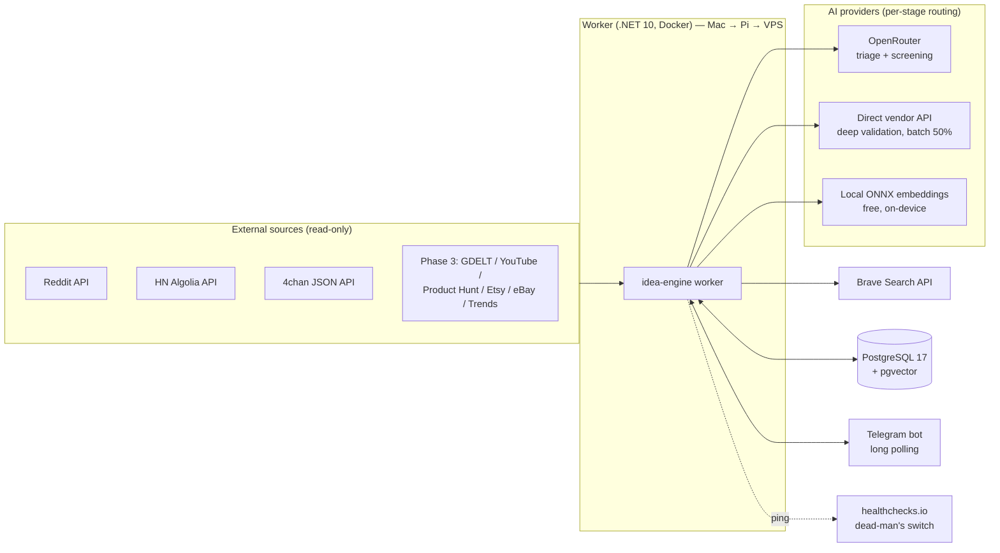
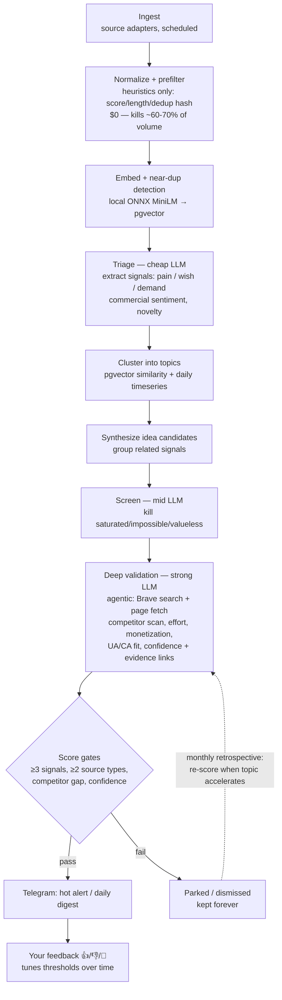
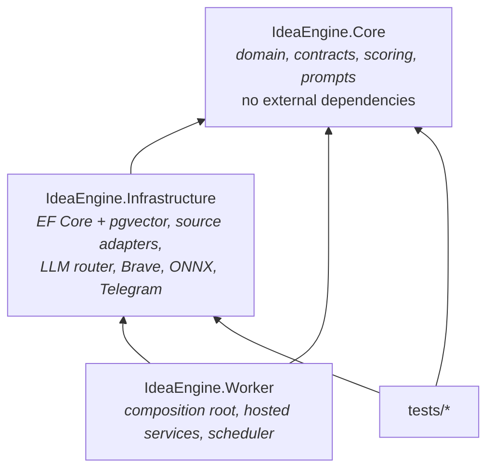
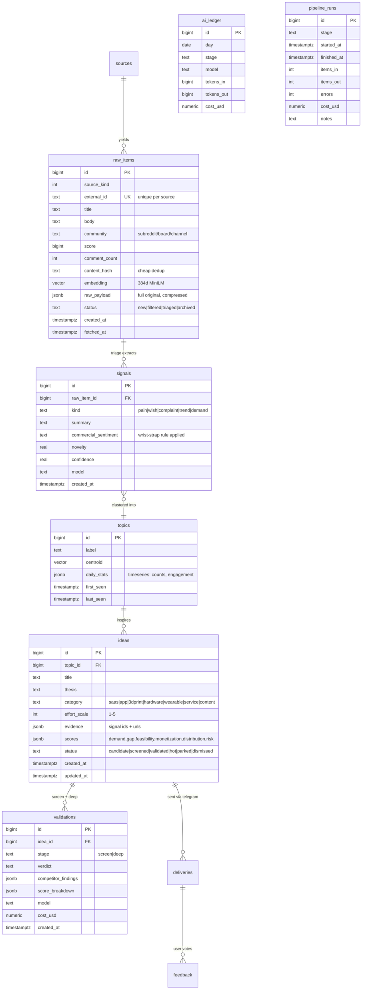
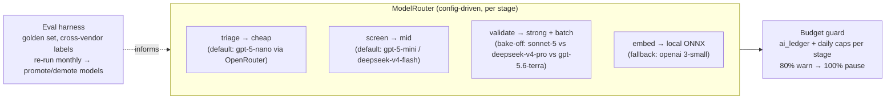
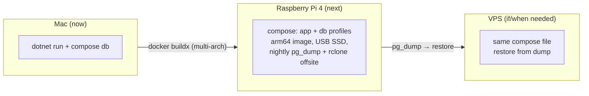

# Architecture

> **This document describes the *target* architecture.** What is actually implemented
> at any moment is tracked in [STATE.md](STATE.md). Diagrams are updated as part of each
> phase's definition of done.

## 1. System context

## 2. Pipeline (the value loop)

**Stage handoff:** every stage reads its input from Postgres and writes its output back
(status columns + `FOR UPDATE SKIP LOCKED`). No in-memory queues across stages → crash-safe
on a Pi, resumable, and stages can later become separate processes without redesign
([ADR-0001](adr/0001-modular-monolith-postgres-queue.md)).

## 3. Solution structure & dependency rule

Rule: **dependencies point inward.** `Core` never references `Infrastructure`.
Everything external (an API, a database, a model provider) hides behind a `Core` interface
(`ISourceAdapter`, `IChatClient` routing, repositories), so parts stay movable.

## 4. Target data model

Storage posture: keep everything useful (raw payloads compressed, all signals/ideas forever).
Only compliance pruning applies (Reddit deleted-content sync,
[ADR-0004](adr/0004-source-tiering-and-compliance.md)). Budget: tens of GB/year is fine.

## 5. AI model routing

Details: [ADR-0002](adr/0002-llm-provider-strategy.md).

## 6. Deployment

Same image, same compose file everywhere; only `.env` and hardware change.
Migration = dump, restore, `docker compose up`.

## 7. Cross-cutting

- **Observability** ([ADR-0003](adr/0003-observability-lean-stack.md)): Serilog console+file,
  Telegram error alerts (deduplicated), `pipeline_runs` summaries surfaced via `/status`,
  healthchecks.io dead-man ping. `ActivitySource` instrumentation from day one → OTel-ready.
- **Resilience:** Polly retry/backoff per external API; circuit breaker per source;
  one source failing never stops the pipeline.
- **Budgets:** hard daily USD caps per stage, enforced before each call batch.
- **Config:** `appsettings.json` (structure) + environment variables from `.env` (secrets).
