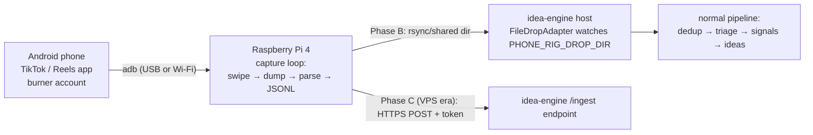

# PHONE-RIG.md — short-video capture rig (build instructions)

> **Audience:** a developer or AI model implementing this WITHOUT the original chat
> context. Read [STATE.md](STATE.md) and [DEVELOPMENT.md](DEVELOPMENT.md) first.
> Status: **design approved by the owner, not yet built.** `SourceKind.PhoneRig = 14`
> is already reserved in code.

## 1. Purpose

Short-video platforms (TikTok, Instagram Reels) are where everyday complaints and
micro-trends surface first, and they expose no usable public API. Owner's decision:
no paid aggregators for now (~$30+/mo deferred until the app proves itself). Instead:
a **physical capture rig** — an old phone auto-browsing the apps while a Raspberry Pi
drives it and extracts on-screen TEXT (captions, hashtags, comments) into JSONL that
idea-engine ingests like any other source.

We capture **text only** (captions/comments/descriptions). No video files are stored,
no frame-by-frame analysis (cost), no redistribution. Personal research scale, single
device, human-like pacing. This is ToS-gray: use a burner account, accept that the
account may be banned, keep volumes modest.

## 2. Device choice

| Device | Verdict | Why |
|---|---|---|
| **Old Android** | ✅ build on this | `adb` gives scripted input + `uiautomator dump` returns the on-screen accessibility tree as XML — most captions/comments arrive as parseable TEXT without OCR |
| Old iPhone | ❌ not first | no adb equivalent; automation needs a Mac running XCUITest/Appium sessions, screen text via OCR only, fragile and Mac-bound. Revisit only if no Android is usable |
| Raspberry Pi 4 | ✅ controller + sink | 24/7 host: drives the phone over USB/Wi-Fi adb, parses dumps, writes JSONL, syncs to the idea-engine host |

## 3. Architecture



- **Phase A** — rig produces JSONL locally (this doc's main scope).
- **Phase B** — idea-engine gets a `FileDropAdapter` (`SourceKind.PhoneRig`) that watches
  a drop directory and ingests JSONL files (contract in §6). Follow the
  “adding a source” checklist in DEVELOPMENT.md.
- **Phase C** — when idea-engine moves to a VPS: add a small authenticated ingest
  endpoint to the worker (`POST /ingest`, bearer token from `.env`, same JSON schema,
  Kestrel on localhost + reverse proxy). The rig stays at home and pushes over HTTPS.
  Keep the file-drop path as fallback.

## 4. Hardware / software checklist

- Android phone (Android 8+), charger, USB cable; screen can stay at minimum brightness
- Burner account for the target app (not the owner's personal account)
- Raspberry Pi 4 (2GB+ fine), Raspberry Pi OS Lite 64-bit, on the same LAN
- Pi packages: `android-tools-adb`, `python3`, `tesseract-ocr` (OCR fallback only),
  optionally `scrcpy` for debugging visibility
- Phone: Developer options → USB debugging ON (and “Wireless debugging” if using Wi-Fi adb)

## 5. Capture loop (reference design)

One Python script on the Pi, systemd-managed. Core cycle:

1. `adb shell input keyevent KEYCODE_WAKEUP` — ensure awake
2. Open the app: `adb shell monkey -p com.zhiliaoapp.musically 1` (TikTok pkg; Reels via Instagram pkg)
3. Per video iteration:
   - dwell: sleep `random.uniform(4, 12)` seconds (human-like; NEVER fixed)
   - dump UI: `adb shell uiautomator dump /sdcard/ui.xml && adb pull /sdcard/ui.xml`
   - parse XML: collect `text=` and `content-desc=` attributes → caption, author,
     hashtags (`#\w+`), like/comment counts when present
   - every N videos (N≈5): open comments (tap coordinates from the dump’s comment
     button bounds), dump again → top comment texts, close (BACK keyevent)
   - OCR fallback (only when the XML text is empty — some app builds render captions
     on a surface): `adb exec-out screencap -p > frame.png` → `tesseract frame.png -`
   - swipe next: `adb shell input swipe 500 1600 500 400 300` (coords per device)
4. Topic rotation: every ~30 min, use the app's search for one term from a rotating
   list (owner's pain buckets: procrastination, ADHD, wake-up struggles, toxic
   teammates, home chores…), browse that feed for a while, return to For You
5. Session discipline: 25–40 min sessions, 15–45 min random breaks, hard daily cap
   (e.g. 4 h total); jitter everything
6. Write one JSONL line per video to `out/rig-YYYYMMDD.jsonl`; rotate daily;
   `rsync` the finished file to the idea-engine host nightly (cron)

Anti-detection posture = behave like a bored human: variable dwell, occasional
back-swipes, no 24/7 marathon, no like/follow automation (read-only browsing).

## 6. JSONL contract (Phase B adapter consumes exactly this)

One JSON object per line:

```json
{
  "source": "tiktok",                // or "reels"
  "captured_at": "2026-08-02T21:14:03Z",
  "kind": "video",
  "video_id": "7301234567890",       // from share-URL if visible, else null
  "author": "@handle",
  "caption": "text incl #hashtags",
  "hashtags": ["fyp", "adhd"],
  "likes": 12300,                     // null when not visible
  "comments_count": 456,              // null when not visible
  "comments": [ {"author": "@a", "text": "…", "likes": 12} ],
  "ocr_text": null,                   // only when XML text was empty
  "search_topic": null,               // set when captured in a topic session
  "device_id": "rig-android-1"
}
```

Adapter mapping (Phase B): `ExternalId` = `video_id` ?? sha256 of (author+caption);
`Title` = caption clipped 120; `Body` = full caption + OCR text; `Community` =
`"{source}:{search_topic ?? "foryou"}"`; `Score` = likes/1000 (0 when null);
comments → `RawComment`. Processed files move to `done/`. Politeness N/A (offline).

## 7. Idea-engine integration checklist (Phase B — follow DEVELOPMENT.md)

- [ ] `FileDropAdapter : ISourceAdapter` (Kind = `PhoneRig`), reads `*.jsonl` from
      `PHONE_RIG_DROP_DIR` (env), yields items, moves consumed files to `done/`
- [ ] `.env.example` + RUNBOOK entry for `PHONE_RIG_DROP_DIR`
- [ ] `SourceKindParser`: `"rig"`/`"phonerig"` alias
- [ ] appsettings section + DI registration (no HttpClient needed)
- [ ] CHANGELOG + version; `/collect rig` then works automatically

## 8. Risks, honestly

- **Account ban** — likely eventually; burner account, re-create, shrug
- **App UI changes** break XML paths — parser must degrade to OCR + log loudly
- **ToS-gray** — personal-scale reading of a feed shown to a logged-in user; no
  scraping infrastructure at scale, no resale of raw content, text-only storage
- **Signal quality** — For You feed is personalized; seed the burner account by
  following pain-bucket topics first, and lean on topic-search sessions

## 9. Effort estimate

Phase A rig: ~1–2 focused days incl. device quirks. Phase B adapter: ~half a day.
Phase C endpoint: ~half a day when the VPS move happens.
